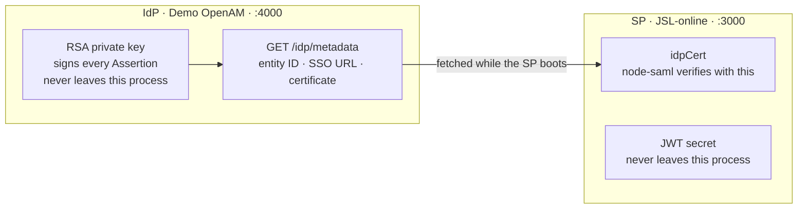
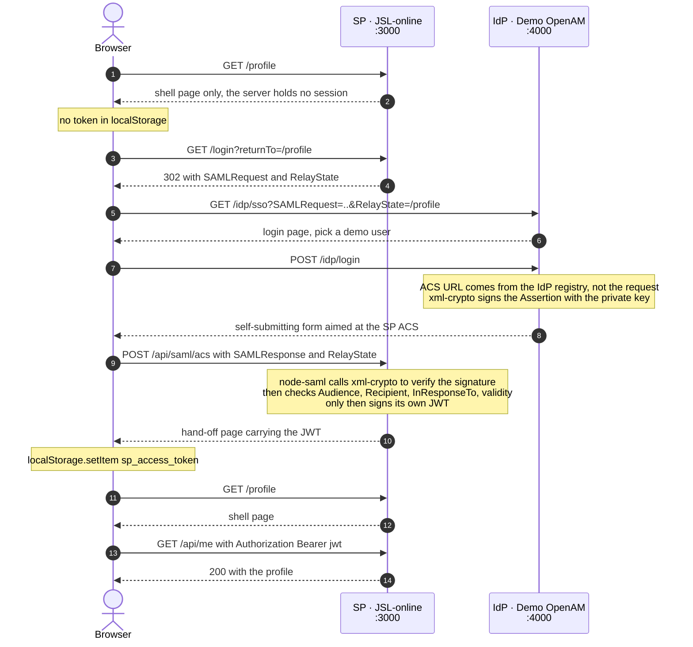
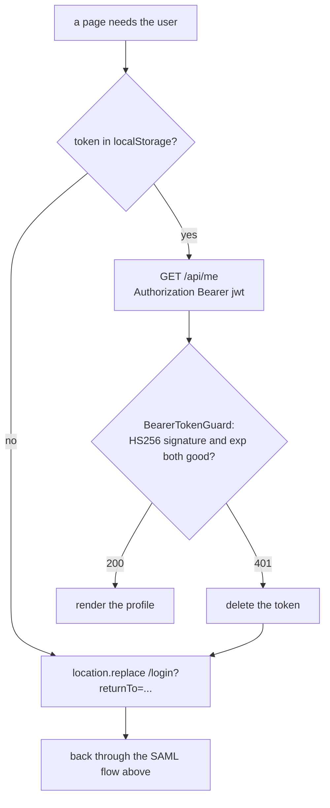
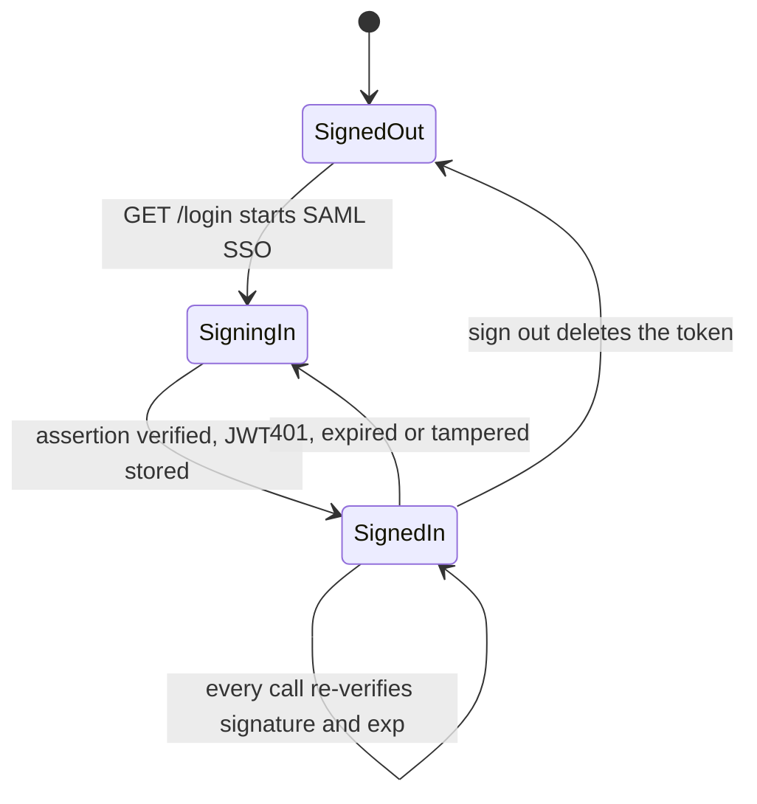
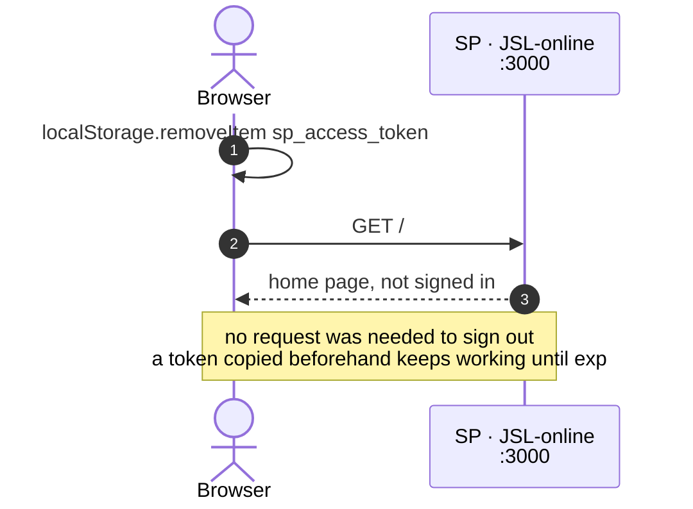

# SAML SSO Demo: how an IdP and an SP cooperate

Two NestJS applications playing both sides of a SAML 2.0 single sign-on, so you can
watch the handshake happen in a browser.

IdP and SP are two **separately deployable applications**, each with its own entry
point, its own configuration, and its own command line. Start them in two terminals.

## Requirements

- Node.js 24 or newer
- npm

TypeScript throughout, compiled by `nest build`. Ports are resolved with
`import.meta`-free CommonJS output, and the code uses `node:util`'s `styleText` and
`parseArgs`, `AbortSignal.timeout()`, and `RegExp.escape()` — hence the Node 24 floor.

## Running it

```bash
npm install

npm run start:idp     # terminal 1 — Demo OpenAM on :4000
npm run start:sp      # terminal 2 — JSL-online on :3000
```

Then open <http://localhost:3000> and click "Sign in through Demo OpenAM".

**Start the IdP first.** The SP imports the signing certificate while its module
initialises, so starting it alone exits with a clear message rather than coming up
half-configured:

```
Cannot read the IdP metadata: http://localhost:4000/idp/metadata is unreachable
```

Each application takes its own options — neither has a flag for the other's port,
because neither owns it:

```bash
npm run start:idp -- --port 4001 --sp-url http://localhost:3001
npm run start:sp  -- --port 3001 --idp-url http://localhost:4001
```

`--sp-url` is registration data: the IdP will only issue assertions for a service
provider it has been told about. `--idp-url` is where the SP goes to fetch trust.

### Endpoints

| Service | Endpoint | Purpose |
| --- | --- | --- |
| IdP | `GET /idp/metadata` | publishes entity ID, SSO URL, and signing certificate |
| IdP | `GET /idp/sso` | receives the AuthnRequest, shows the login page |
| IdP | `POST /idp/login` | signs a SAMLResponse and auto-POSTs it back to the SP |
| SP | `GET /login` | builds an AuthnRequest and redirects to the IdP |
| SP | `GET /api/saml/metadata` | SP metadata, to be registered with the IdP |
| SP | `POST /api/saml/acs` | validates the SAMLResponse, issues the SP's own JWT |
| SP | `GET /profile` | shell page; its script verifies the token |
| SP | `GET /api/me` | the SP's own API — requires `Authorization: Bearer <jwt>` |

## How the two sides cooperate

### 1. Trust, established once at startup

Before any user is involved, the SP has to learn who it should believe. That happens
exactly once, over one HTTP call, and it is the only channel between the two:



`ServiceProviderModule` declares that certificate as an **async provider**, so the SP
application cannot finish initialising until the fetch succeeds. Start the SP with the
IdP down and it exits instead of coming up half-configured. **The SP never touches the
IdP private key, and the IdP never learns the SP's JWT secret.**

### 2. Signing in



Step 12 needs a page rather than a redirect: the IdP POSTed from **its** origin, so only
a script served by the SP can write to the SP's localStorage.

```html
<div id="token-handoff" data-access-token="…" data-return-to="/profile"></div>
<script>
    const handoff = document.getElementById("token-handoff").dataset;
    localStorage.setItem("sp_access_token", handoff.accessToken);
    location.replace(handoff.returnTo);
</script>
```

### 3. Staying signed in

The SP stores nothing. "Signed in" is not a row in a table — it is whether the token the
browser presents still verifies:



Over the whole lifetime of a sign-in that gives:



### 4. Signing out



That last note is the honest part of this design, and there is an end-to-end test
asserting it so it cannot quietly stop being true.

### Tampering

The IdP login page has a "simulate a man-in-the-middle" checkbox. With it ticked, the
IdP rewrites `role` to `administrator` *after* signing, then hands the result to the
browser to POST. The SP's ACS answers `Invalid signature` and issues no token.

## Tests

```bash
npm test           # all 64 cases
npm run test:unit  # models and services only, no HTTP or keys needed
npm run test:e2e   # end to end, boots both applications for real
```

Jest with `ts-jest`. Unit specs sit next to the code they cover (`*.spec.ts`) and build
their subject with `Test.createTestingModule`, binding fake implementations to the same
ports the production module binds real ones to:

```ts
const moduleRef = await Test.createTestingModule({
    providers: [
        IssueSamlResponseUseCase,
        UserDirectory,
        ServiceProviderRegistry,
        { provide: IDENTITY_PROVIDER_CONFIG, useValue: IDENTITY_PROVIDER },
        { provide: AssertionSigner, useValue: recordingSigner },
        { provide: Clock, useClass: FixedClock },
    ],
}).compile();
```

The end-to-end suite (`test/single-sign-on.e2e-spec.ts`) needs both applications at
once, which production never does, so `test/start-both-applications.ts` puts the pair in
one process — the only place that orchestration exists. It then drives them with a
cookie-keeping `fetch` acting as a browser, asserting each hop, and covers three
rejection paths: man-in-the-middle tampering (`Invalid signature`), replaying the same
SAMLResponse (`InResponseTo is not valid`), and a malformed AuthnRequest. It listens on
ports 14000/15000, so it can run while a development server is up.

## What the two libraries do

### `xml-crypto`

Low-level XML digital signatures: canonicalization, digests, RSA signing and
verification — plus `getSignedReferences()`, which returns the only XML the signature
actually covers.

### `@node-saml/node-saml`

The SAML protocol proper: building the AuthnRequest, base64-decoding the SAMLResponse,
calling `xml-crypto` internally to verify, then checking Audience, Recipient,
InResponseTo, and NotBefore / NotOnOrAfter before returning a user profile.

In one sentence: **`xml-crypto` proves this XML was not modified; `node-saml` proves
this login result is meant for us, is valid right now, and came from the IdP we trust.**

## Layout

IdP and SP are two independent Nest modules that never import each other — they
cooperate over HTTP alone. Inside each, files are grouped by technical layer.

```text
docs/design/saml-sso-http.md  design doc: boundaries, dependency direction, test strategy

src/identity-provider/        Demo OpenAM — deployable on its own
├── main.ts                   entry point: --port, --sp-url
├── identity-provider.config.ts   its own configuration, including the SP registry
├── models/                   user directory, SP registry, SAMLResponse and metadata factories
├── services/                 issuing use case, xml-crypto signer, AuthnRequest parser,
│                             signing credential
├── controllers/              @Controller with @Render
├── presenters/               use-case result -> view model
├── views/                    login.ejs, auto-post.ejs
└── identity-provider.module.ts   binds every port to an implementation

src/service-provider/         JSL-online — deployable on its own
├── main.ts                   entry point: --port, --idp-url
├── service-provider.config.ts    its own configuration
├── models/                   authenticated-user.ts
├── services/                 start/complete SSO use cases, node-saml, JWT issuer, metadata client
├── controllers/
├── presenters/
├── views/                    home.ejs, store-token.ejs, profile.ejs
└── service-provider.module.ts

src/shared/                   web plumbing neither application should reinvent
├── clock.ts                  Clock port + SystemClock
├── create-web-application.ts NestFactory + views + failure filter
├── saml-failure.filter.ts    @Catch() filter: domain failure -> 400 + cause chain in the log
├── web-layer.ts              view directories and static assets
├── x509-certificate.ts       PEM <-> base64 body
├── views/                    common layout: _head.ejs, _foot.ejs
└── public/demo.css

test/                         end-to-end suite + the only code that starts both at once
```

Neither application imports anything from the other — not a config file, not a
constant. The IdP is told which service providers to trust; the SP is told where to
fetch trust from. Everything else travels over HTTP.

Which layer a file belongs to is decided by *what makes it change*:

| Directory | Reason to change |
| --- | --- |
| `models/` | a business rule changed |
| `services/` | a workflow changed, or an external library or store was swapped |
| `controllers/` | the wire protocol changed |
| `presenters/`, `views/` | the page output changed |
| `*.module.ts` | an implementation was swapped (the JWT issuer for an opaque-token one, say) |

Ports are abstract classes, so they survive compilation and double as injection tokens:

```ts
export abstract class AssertionSigner {
    abstract signAssertion(samlResponseXml: string): string;
}

// in the module — the only place an implementation is named
{ provide: AssertionSigner, useClass: XmlCryptoAssertionSigner }
```

No HTML or CSS lives in TypeScript. Markup sits in each application's `views/*.ejs`,
`@Render("login")` names the template, and a presenter turns the use-case result into
exactly the data that template needs. Every page opens with
`include("_head", { title })` and closes with `include("_foot")`.

### What this costs

Choosing localStorage over an `httpOnly` cookie is a real trade, and the demo does not
hide it:

- **Any XSS on the SP reads the token.** An `httpOnly` cookie is unreachable from
  JavaScript; a localStorage entry is not.
- **Nothing can be revoked.** A JWT is valid until `exp`. Signing out clears the
  browser's copy, but a token captured beforehand keeps working — there is an
  end-to-end test asserting exactly that, so the property stays visible.
- **CSRF stops being a concern**, since no credential is attached automatically.

The usual production answer is short-lived tokens plus a refresh mechanism, or a
server-side session after all.

## How production differs

- The IdP private key and certificate come from a corporate PKI and are long-lived;
  this demo mints a throwaway pair on every start.
- The AuthnRequest context belongs in the IdP's own session; this demo passes it in
  hidden form fields.
- The JWT secret is minted fresh on every start, so a restart silently invalidates
  every token still sitting in a browser. Production reads a stable secret from a
  secret manager.
- `SamlFailureFilter` returns the rejection reason to the browser so the demo is
  readable. A production SP would show a generic page and keep the detail in the log.
- `tampering.simulator.ts` is an attack simulation for teaching purposes and has no
  place in production code.
