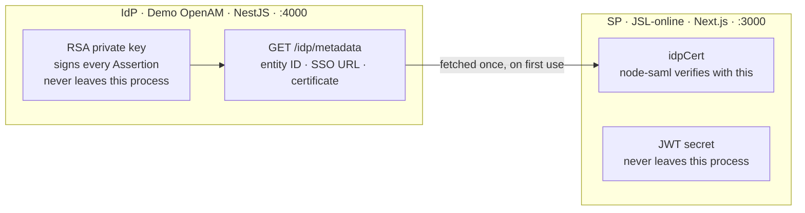
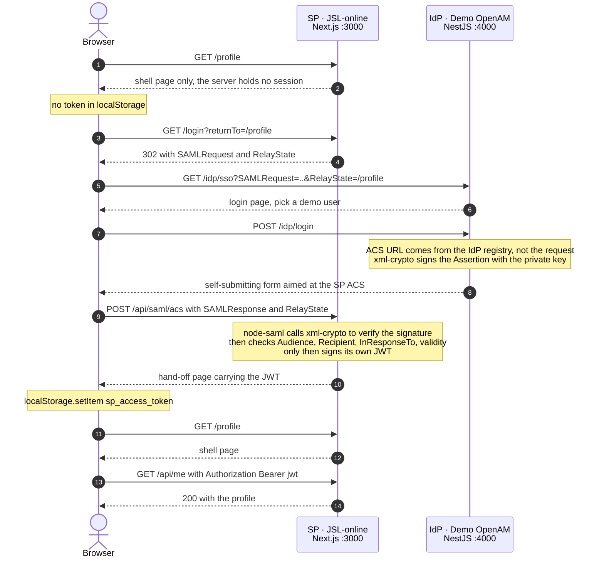
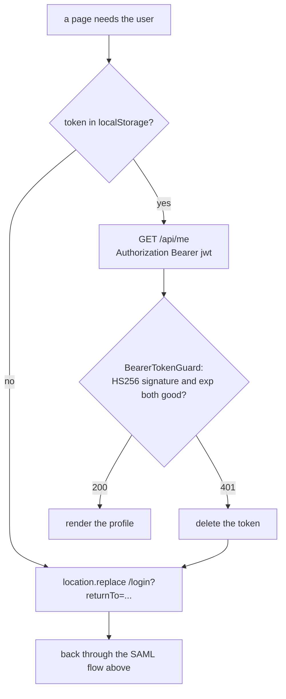
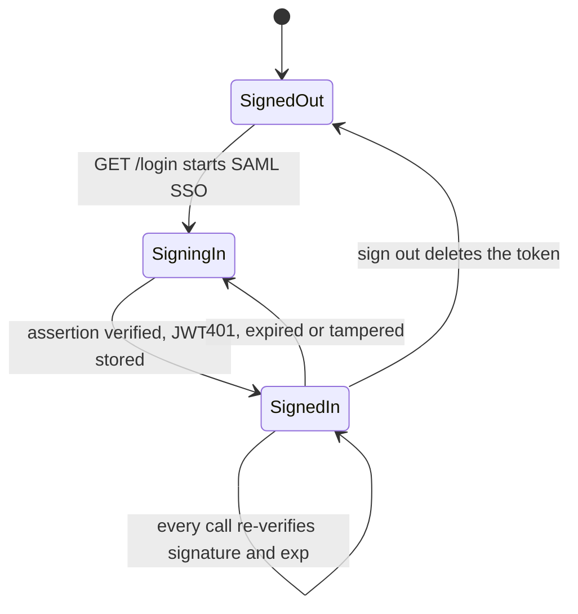
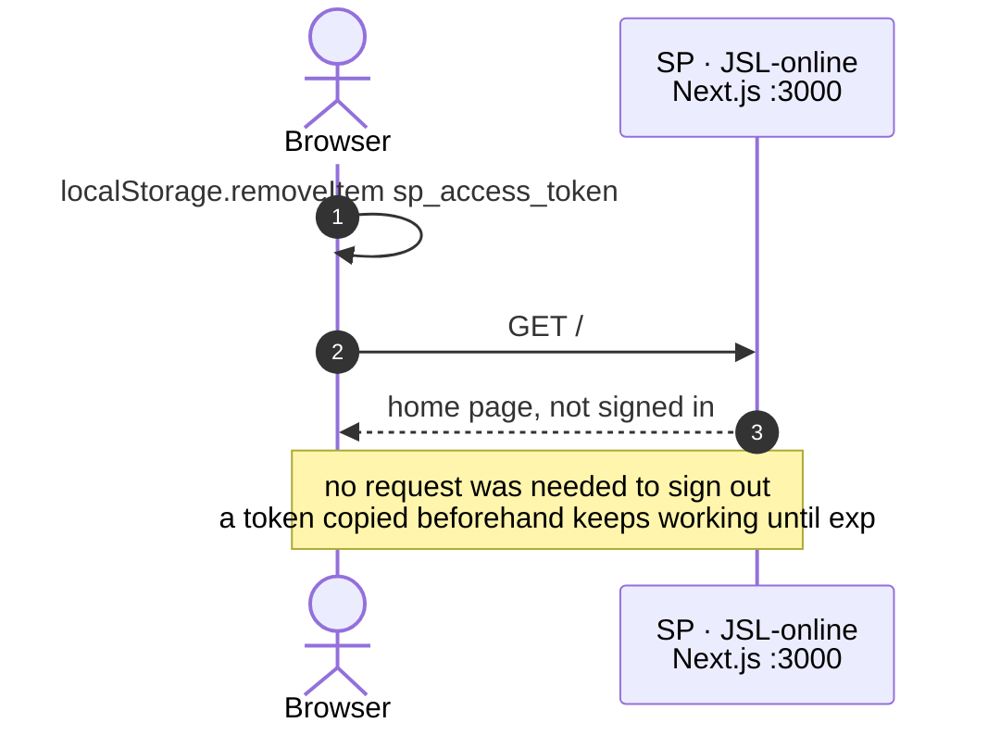

# SAML SSO Demo: how an IdP and an SP cooperate

Two applications playing both sides of a SAML 2.0 single sign-on, so you can watch the
handshake happen in a browser:

- **Demo OpenAM** — the identity provider, on **NestJS**
- **JSL-online** — the service provider, on **Next.js**

Deliberately different stacks: SAML is an interoperability protocol, and the two sides
share nothing but HTTP.

IdP and SP are two **separately deployable applications**, each with its own entry
point, its own configuration, and its own command line. Start them in two terminals.

## Requirements

- Node.js 24 or newer
- npm

TypeScript throughout. An npm workspace per application, so neither drags the other's
dependencies along:

```text
apps/identity-provider   NestJS + EJS + xml-crypto      (nest build)
apps/service-provider    Next.js + React + jose         (next build)
e2e                      the only package that runs both at once
```

The code uses `node:util`'s `styleText` and `parseArgs`, `AbortSignal.timeout()`, and
`RegExp.escape()` — hence the Node 24 floor.

## Running it

```bash
npm install
npm run build         # nest build + next build

npm run start:idp     # terminal 1 — Demo OpenAM on :4000
npm run start:sp      # terminal 2 — JSL-online on :3000
```

For iterating, `npm run dev:idp` and `npm run dev:sp` watch and reload instead.

Then open <http://localhost:3000> and click "Sign in through Demo OpenAM".

**Start the IdP first.** The SP imports the signing certificate the first time SSO is
used. Next gives no reliable "the server is booting" hook — a route handler may be the
first thing that runs — so unlike the Nest version the SP starts happily on its own and
fails on the first request instead:

```
SP rejected the request: Cannot read the IdP metadata: http://localhost:4000/idp/metadata is unreachable
```

The fetch is memoised, so it happens once per process and every later request reuses the
same trust.

Each application takes its own configuration — neither has a knob for the other's port,
because neither owns it. The IdP takes command-line flags; Next has nowhere to hang
those, so the SP reads the environment:

```bash
npm run start:idp -- --port 4001 --sp-url http://localhost:3001

SP_BASE_URL=http://localhost:3001 \
IDP_BASE_URL=http://localhost:4001 \
SP_ACCESS_TOKEN_SECRET=change-me-in-production \
  npm run start:sp -- --port 3001
```

`--sp-url` is registration data: the IdP will only issue assertions for a service
provider it has been told about. `IDP_BASE_URL` is where the SP goes to fetch trust.
`SP_ACCESS_TOKEN_SECRET` signs the SP's own JWTs — without it the SP mints a random one
per process, which is fine for one machine and wrong for anything with two instances.

### Endpoints

| Service | Endpoint | Purpose |
| --- | --- | --- |
| IdP | `GET /idp/metadata` | publishes entity ID, SSO URL, and signing certificate |
| IdP | `GET /idp/sso` | receives the AuthnRequest, shows the login page |
| IdP | `POST /idp/login` | signs a SAMLResponse and auto-POSTs it back to the SP |
| SP | `GET /login` | builds an AuthnRequest and redirects to the IdP |
| SP | `GET /api/saml/metadata` | SP metadata, to be registered with the IdP |
| SP | `POST /api/saml/acs` | validates the SAMLResponse, issues the SP's own JWT |
| SP | `GET /profile` | shell page; its script verifies the token |
| SP | `GET /api/me` | the SP's own API — requires `Authorization: Bearer <jwt>` |

## How the two sides cooperate

### 1. Trust, established once at startup

Before any user is involved, the SP has to learn who it should believe. That happens
exactly once, over one HTTP call, and it is the only channel between the two:



The SP's composition root (`src/service-provider.runtime.ts`) memoises that fetch, so
the certificate is imported once per process. **The SP never touches the IdP private
key, and the IdP never learns the SP's JWT secret.**

### 2. Signing in



The hand-off needs a page rather than a redirect: the IdP POSTed from **its** origin, so
only a script served by the SP can write to the SP's localStorage. The token stays in
the response body rather than a `Location` header, which proxies and access logs keep.

```html
<!-- src/token-handoff.page.ts, returned by POST /api/saml/acs -->
<div id="token-handoff" data-access-token="…" data-return-to="/profile"></div>
<script>
    const handoff = document.getElementById("token-handoff").dataset;
    localStorage.setItem("sp_access_token", handoff.accessToken);
    location.replace(handoff.returnTo);
</script>
```

It is a plain string rather than a React component because Next refuses to let a route
handler import `react-dom/server`, and this document is deliberately outside the app
layout — it is visible for a few milliseconds and should not wait on a bundle.

### 3. Staying signed in

The SP stores nothing. "Signed in" is not a row in a table — it is whether the token the
browser presents still verifies:



Over the whole lifetime of a sign-in that gives:



### 4. Signing out



That last note is the honest part of this design, and there is an end-to-end test
asserting it so it cannot quietly stop being true.

### Tampering

The IdP login page has a "simulate a man-in-the-middle" checkbox. With it ticked, the
IdP rewrites `role` to `administrator` *after* signing, then hands the result to the
browser to POST. The SP's ACS answers `Invalid signature` and issues no token.

## Tests

```bash
npm test           # everything: 47 unit + 16 end-to-end
npm run test:unit  # both workspaces, no HTTP or keys needed
npm run test:e2e   # builds and starts both applications for real
```

Unit specs sit next to the code they cover. The IdP is a Nest app, so its specs build
their subject with `Test.createTestingModule`; the SP has no DI container, so a fake is
just an object literal:

```ts
const gateway: SamlGateway = {
    async createLoginRedirectUrl(relayState) { relayStates.push(relayState); return "..."; },
    validateSamlResponse() { throw new Error("not used in this test"); },
    describeMetadata() { throw new Error("not used in this test"); },
};

await new StartSingleSignOnUseCase(gateway).execute({returnTo: "/profile"});
```

The `e2e` package is the only code anywhere that runs both applications at once. Its
`globalSetup` builds each workspace, spawns `node apps/identity-provider/dist/main.js`
and `next start`, and waits for both to answer; the specs then drive them with `fetch`.
Ports 14000/15000, so a development server can stay up.

It covers the whole handshake plus four rejection paths: man-in-the-middle tampering
(`Invalid signature`), a replayed SAMLResponse (`InResponseTo is not valid`), a
malformed AuthnRequest, and a JWT whose payload was edited after signing.

What it does *not* cover, in either the Nest or the Next version: that the hand-off
script actually runs and writes localStorage. Verifying that needs a real browser —
Playwright would be the next step.

## What the two libraries do

### `xml-crypto`

Low-level XML digital signatures: canonicalization, digests, RSA signing and
verification — plus `getSignedReferences()`, which returns the only XML the signature
actually covers.

### `@node-saml/node-saml`

The SAML protocol proper: building the AuthnRequest, base64-decoding the SAMLResponse,
calling `xml-crypto` internally to verify, then checking Audience, Recipient,
InResponseTo, and NotBefore / NotOnOrAfter before returning a user profile.

In one sentence: **`xml-crypto` proves this XML was not modified; `node-saml` proves
this login result is meant for us, is valid right now, and came from the IdP we trust.**

## Layout

IdP and SP are separate npm workspaces that never import each other — not a config file,
not a constant. They cooperate over HTTP alone.

```text
docs/design/saml-sso-http.md   design doc: boundaries, dependency direction, test strategy

apps/identity-provider/        Demo OpenAM — NestJS
├── src/main.ts                entry point; --port, --sp-url
├── src/identity-provider.config.ts    its config, including the SP registry
├── src/models/                user directory, SP registry, SAMLResponse + metadata factories
├── src/services/              issuing use case, xml-crypto signer, AuthnRequest parser
├── src/controllers/           @Controller with @Render
├── src/presenters/            use-case result -> view model
├── src/views/                 login.ejs, auto-post.ejs
├── src/shared/                Clock port, exception filter, view layer, X.509
└── src/identity-provider.module.ts    binds every port to an implementation

apps/service-provider/         JSL-online — Next.js
├── app/                       App Router: pages and route handlers
│   ├── page.tsx               home (server component)
│   ├── profile/               shell page + the client component that verifies the token
│   ├── login/route.ts         starts SSO
│   └── api/
│       ├── saml/metadata/     SP metadata
│       ├── saml/acs/          validates the assertion, mints the JWT
│       └── me/route.ts        the SP's own API, behind the bearer token
└── src/                       everything that is not Next
    ├── config/                reads SP_BASE_URL, IDP_BASE_URL, SP_ACCESS_TOKEN_SECRET
    ├── domain/                authenticated-user.ts
    ├── services/              use cases, node-saml gateway, jose issuer, metadata client
    ├── presenters/            profile.presenter.ts
    ├── service-provider.runtime.ts    the composition root
    └── token-handoff.page.ts  the document that moves the JWT into localStorage

e2e/                           builds and runs both, then drives them with fetch
```

### What the two stacks share, and what they do not

The SP's `src/` came across from the Nest version almost unchanged — use cases, the
node-saml gateway, the metadata client, the domain model. That is the payoff of keeping
them free of framework imports. What had to change was only the framework layer:

| | NestJS | Next.js |
| --- | --- | --- |
| Wiring | DI container, `*.module.ts` | one memoised factory, `service-provider.runtime.ts` |
| Ports | abstract classes (need a runtime token) | plain interfaces |
| Routing | `@Controller` + `@Get` | `app/**/route.ts` |
| Views | EJS templates + presenters | React server and client components |
| JWT | `@nestjs/jwt` | `jose` |
| Config | `parseArgs` flags | environment variables |
| Auth check | `CanActivate` guard | a function each route handler calls |

Which layer a file belongs to is still decided by *what makes it change*:

| Directory | Reason to change |
| --- | --- |
| `models/`, `domain/` | a business rule changed |
| `services/` | a workflow changed, or an external library was swapped |
| `controllers/`, `app/**/route.ts` | the wire protocol changed |
| `presenters/`, `views/`, `app/**/page.tsx` | the page output changed |
| `*.module.ts`, `service-provider.runtime.ts` | an implementation was swapped |

### What this costs

Choosing localStorage over an `httpOnly` cookie is a real trade, and the demo does not
hide it:

- **Any XSS on the SP reads the token.** An `httpOnly` cookie is unreachable from
  JavaScript; a localStorage entry is not.
- **Nothing can be revoked.** A JWT is valid until `exp`. Signing out clears the
  browser's copy, but a token captured beforehand keeps working — there is an
  end-to-end test asserting exactly that, so the property stays visible.
- **CSRF stops being a concern**, since no credential is attached automatically.

The usual production answer is short-lived tokens plus a refresh mechanism, or a
server-side session after all.

## How production differs

- The IdP private key and certificate come from a corporate PKI and are long-lived;
  this demo mints a throwaway pair on every start.
- The AuthnRequest context belongs in the IdP's own session; this demo passes it in
  hidden form fields.
- The JWT secret is minted fresh on every start, so a restart silently invalidates
  every token still sitting in a browser. Production reads a stable secret from a
  secret manager.
- Both sides return the rejection reason to the browser so the demo is readable. A
  production SP would show a generic page and keep the detail in the log.
- The SP's JWT secret falls back to a random per-process value. Anything running more
  than one instance must set `SP_ACCESS_TOKEN_SECRET`, or a token minted by one instance
  is rejected by the next.
- `tampering.simulator.ts` is an attack simulation for teaching purposes and has no
  place in production code.
